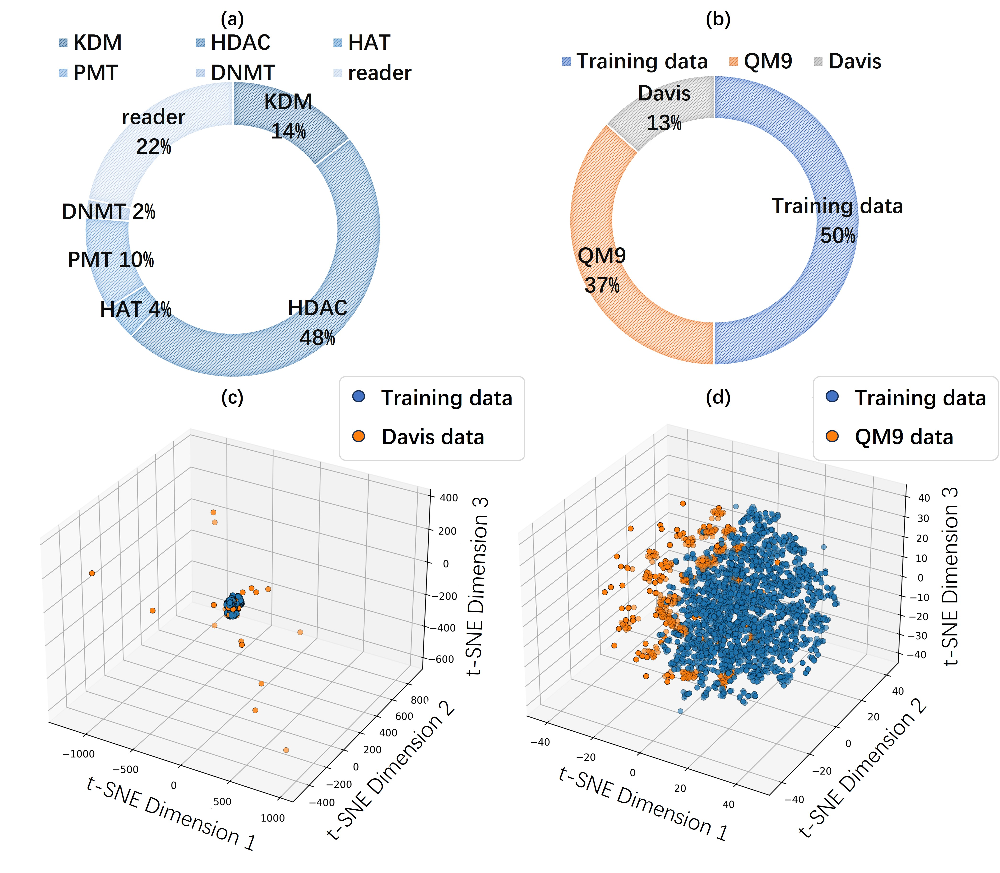
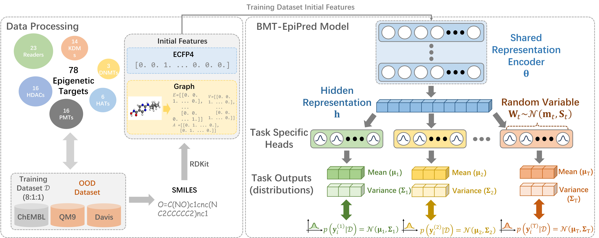
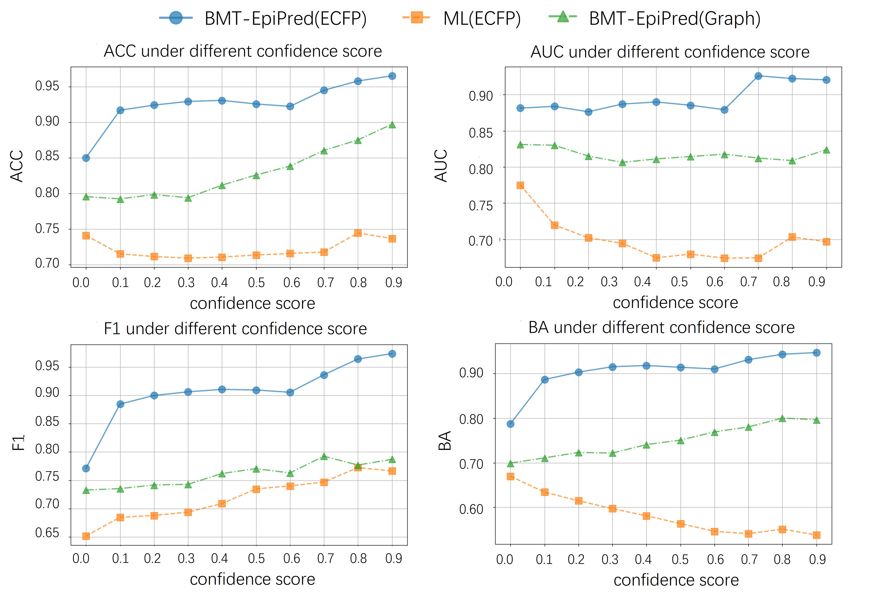
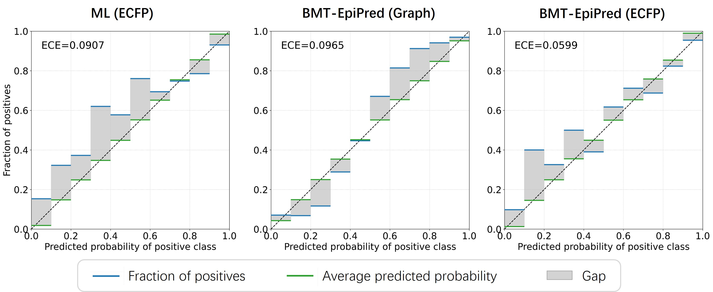
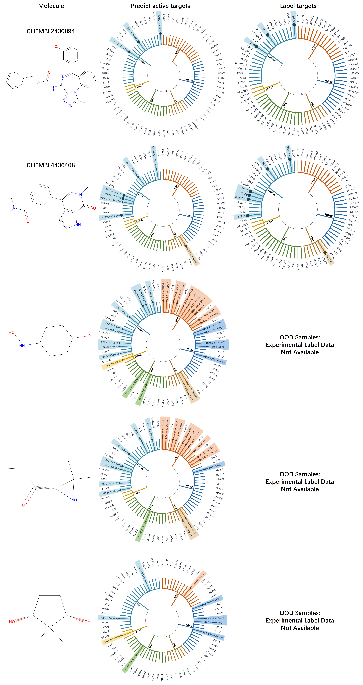

# BMT-EpiPred: Bayesian Multitask Learning for Reliable Prediction of Small-Molecule Epigenetic Modulators

This repository provides the implementation for BMT-EpiPred, a novel computational framework for predicting the activity of small-molecule compounds on various epigenetic targets.

## Introduction

The development of drugs targeting epigenetic regulators is a promising area in therapeutics. However, it faces significant hurdles such as limited selectivity, complex biological networks, and scarcity of data. Computational methods, particularly machine learning, can help overcome these challenges.

BMT-EpiPred is a Bayesian multitask learning (MTL) framework designed to address these issues. It learns from multiple epigenetic targets simultaneously, which improves data efficiency and generalization. A key feature of BMT-EpiPred is its ability to quantify the uncertainty of its predictions. This helps in identifying reliable predictions and flagging potentially erroneous ones for novel molecules, which is crucial for reducing risks and saving resources in drug discovery.

## Key Features

*   **Multitask Learning:** Predicts compound activity across 78 epigenetic targets in a single model, leveraging correlations between targets to enhance performance.
*   **Uncertainty Quantification:** Employs a Bayesian approach to provide probabilistic predictions, allowing users to assess the model's confidence.
*   **Out-of-Distribution (OOD) Detection:** Capable of identifying molecules that are chemically different from its training data, preventing overconfident and incorrect predictions on novel compounds.
*   **High Accuracy:** Achieves state-of-the-art performance compared to conventional single-task models and other MTL approaches.
*   **Reliability:** Integrates uncertainty to distinguish between reliable high-confidence predictions and unreliable ones, adding a layer of trust for experimental validation.

## Data & Model Architecture

The model was developed using data from the ChEMBL database. The training dataset includes 19,527 compounds and their activities against 78 epigenetic targets. For OOD detection evaluation, molecules from the QM9 and Davis datasets were used.

<!-- INSERT FIGURE 1 HERE -->

<!-- 
<b>[Image Placeholder for Figure 1: Data distribution and t-SNE plots]</b>
 -->

BMT-EpiPred uses a shared feature encoder to create a latent representation of a molecule from its chemical structure (using ECFP fingerprints or a graph-based representation). This shared knowledge is then fed into multiple, independent probabilistic "prediction heads," one for each epigenetic target, to predict the activity.

<!-- INSERT FIGURE 2 HERE -->

<!--  -->
<!-- 
<b>[Image Placeholder for Figure 2: BMT-EpiPred model architecture]</b>
 -->

## Performance Highlights

### Predictive Accuracy

BMT-EpiPred shows superior performance across five key metrics (Accuracy, F1, MCC, Precision, Recall) when compared to a variety of baseline machine learning models.

<!-- INSERT TABLE 1 HERE -->
### Table 1: Comparative Results of Experimental Evaluations

This table compares the predictive performance of our proposed models against various baselines across five standard metrics. All metrics are evaluated on the test set, where higher values indicate better performance.

| Model                       | Accuracy (↑) | F1 (↑)    | MCC (↑)      | Precision (↑) | Recall (↑) |
|:----------------------------|:------------:|:---------:|:------------:|:-------------:|:----------:|
| SVM [26]                    | 0.870        | 0.854     | 0.599        | 0.848         | 0.874      |
| LR                          | 0.868        | 0.858     | 0.617        | 0.858         | 0.866      |
| NN                          | 0.847        | 0.833     | 0.522        | 0.825         | 0.858      |
| CNN [27]                    | 0.582        | 0.646     | 0.153        | 0.717         | 0.588      |
| VMTL [28]                   | 0.624        | 0.606     | 0.413        | **0.945**     | 0.446      |
| PreGNN [25]                 | 0.492        | 0.600     | -0.092       | 0.613         | 0.587      |
| MT-EpiPred [19]             | 0.870        | 0.864     | 0.660        | 0.883         | 0.853      |
| ML (ECFP)                   | 0.728        | 0.789     | 0.405        | 0.790         | 0.789      |
| BMT-EpiPred (Graph, ours)   | 0.845        | 0.881     | 0.660        | 0.879         | 0.883      |
| **BMT-EpiPred (ECFP, ours)**| **0.891**    | **0.916** | **0.763**    | 0.922         | **0.909**  |

---

#### Model / Method Abbreviations:
*   **LR:** Logistic Regression
*   **NN:** Neural Network
*   **CNN:** Convolutional Neural Network
*   **GNN:** Graph Neural Network
*   **ML:** Margin Likelihood (a baseline variant)
<!-- You can create a markdown table or insert an image of the table -->
<!-- 
<b>[Placeholder for Table 1: Comparative results of experimental evaluations]</b>
 -->

### Uncertainty and Confidence

A core strength of the model is its well-calibrated uncertainty. As shown below, the model's performance metrics (like accuracy) improve as we filter for higher-confidence predictions, demonstrating that its uncertainty measure is reliable.

<!-- INSERT FIGURE 3 HERE -->

<!--  -->
<!-- 
<b>[Image Placeholder for Figure 3: Performance metrics under varying confidence scores]</b>
 -->

The model's predictions are more closely aligned with actual outcomes compared to other models, as shown by the calibration curves.

<!-- INSERT FIGURE 4 HERE -->

<!--  -->

<b>[Image Placeholder for Figure 4: Model calibration curves]</b>

### Application in Practice

The model can be used to screen new molecules. The example below shows predictions for two compounds. For the "in-distribution" compound (one that is similar to the training data), the model correctly predicts its active targets with high confidence. For the "OOD" compound, the model still makes predictions, but critically, it assigns them a low confidence score, correctly signaling that the results are not trustworthy.

<!-- INSERT FIGURE 5 HERE -->

<!-- 
<b>[Image Placeholder for Figure 5: Prediction examples for in-distribution and OOD compounds]</b>
 -->

## Requirements and Installation

To set up the environment and run the code, please follow the steps below.

### 1. Environment Setup

It is highly recommended to use a virtual environment to avoid conflicts with other projects. This project is tested with:

*   **Python**: 3.11+
*   **PyTorch**: 2.1.0+cu121
*   **RDKit**: 2023.9.1

### 2. Code & Dataset Download

The dataset used in our paper can be downloaded from ./data/ directory.
After downloading, please place the dataset files in the ./data/ directory. The expected structure is:

BMT-EpiPred/
├── data/
│   ├── training_set.csv
│   ├── test_set.csv
│   └── ood_set.csv
└── ...

### 3. File Path

The expected structure is:

BMT-EpiPred/
├── data/
│   ├── training_set.csv
│   ├── test_set.csv
│   └── ood_set.csv
└── ...

